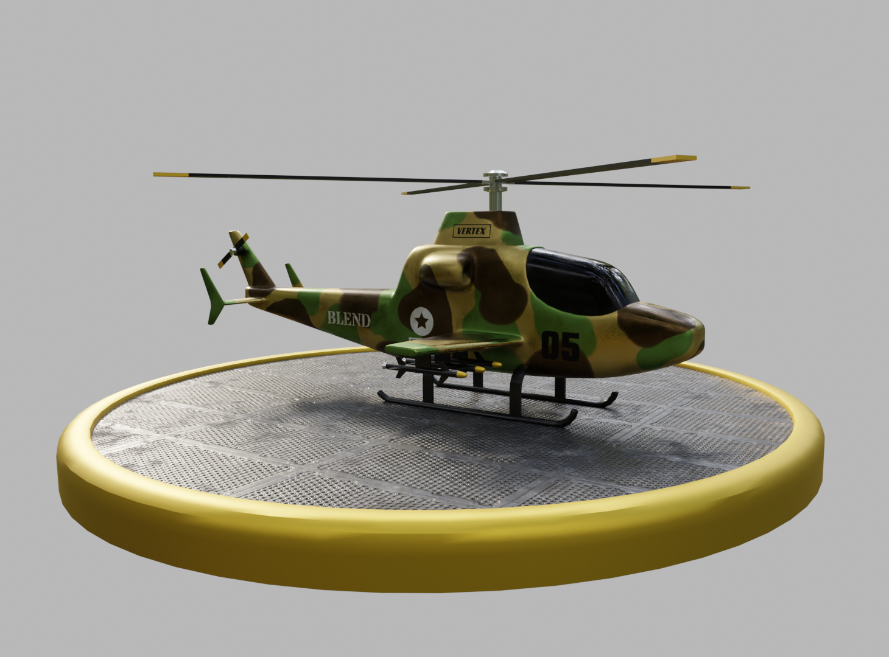

# This is a [Blender](https://www.blender.org/) and [ThreeJS](https://threejs.org/) project.




## Getting Started

First, clone this repository:

```bash
https://github.com/felipealbuq/war-helicopter.git
```

Open the file war-helicopter.blend and see the result. You can see smooth takeoffs,
complemented by realistc textures and shading.


## Animation from Blender Renderer

https://github.com/felipealbuq/war-helicopter/assets/60708056/7320afad-b12a-4916-8718-c87bc46aa52c


## ThreeJS Preview


https://github.com/felipealbuq/war-helicopter/assets/60708056/84338710-a2f1-4353-923b-e77ca4d5e973


## Learn More

To learn more about Blender, take a look at the following resources:

- [Blender Documentation](https://docs.blender.org/) - learn about Blender.

- [Blender Studio](https://studio.blender.org/welcome/) - Blender tutorials.

- [ThreeJS Documentation](https://threejs.org/docs/index.html#manual/en/introduction/Creating-a-scene) - Learn about ThreeJS.

- [ThreeJS Examples](https://threejs.org/examples/#webgl_animation_keyframes) - ThreeJS Examples.


## Deploy on Vercel

Check out my [War Helicopter ]()


